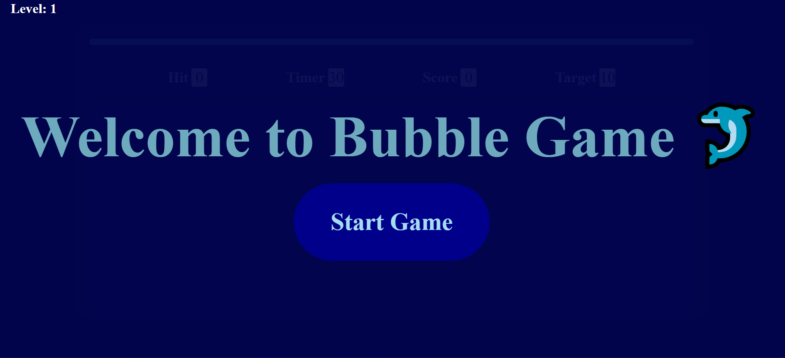
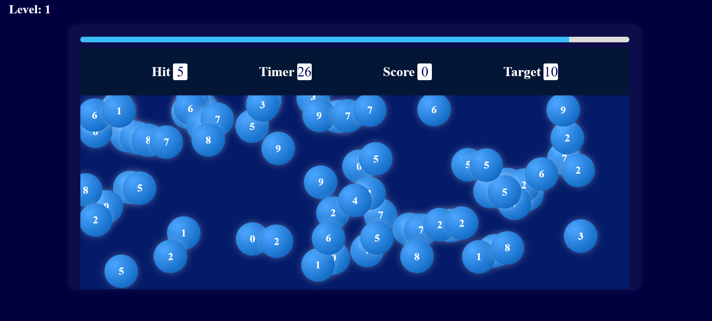
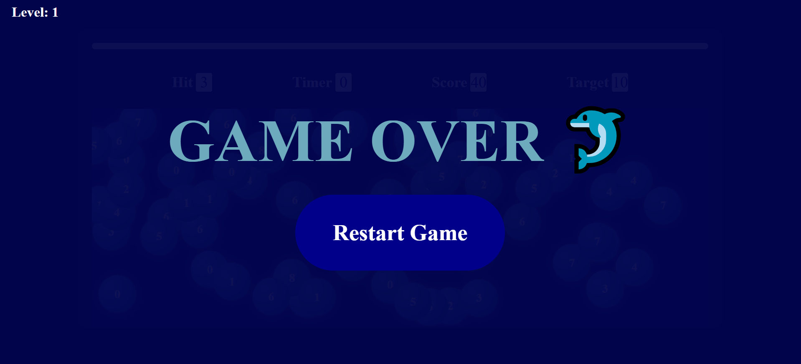
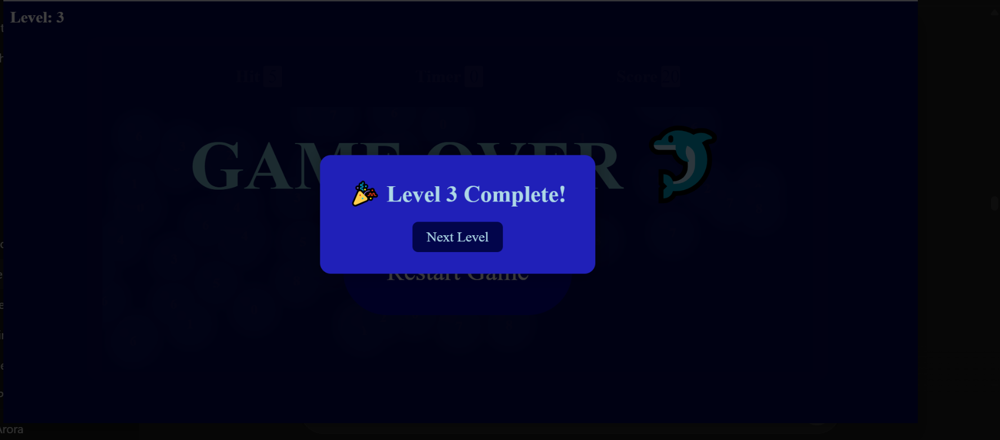

# 🎮 Bubble Game

A fun, interactive bubble-popping game built using **HTML, CSS, JavaScript**, and **GSAP animations**. Each level increases in difficulty, testing speed and precision. Designed for responsive web play.

---

## 🚀 Live Demo

👉 [Play Here](https://your-live-link.netlify.app) *(will update after deployment)*

---

## 🛠 Tech Stack

- HTML5, CSS3
- Vanilla JavaScript
- GSAP (GreenSock Animation Platform)
- Audio Integration

---

## 🔥 Features

- 🎯 Pop the correct bubbles before time runs out
- ⏳ Level-based timer with increasing difficulty
- 🧠 Score tracking and level progress
- 🔊 Sound effects on pop, game over, and level up
- 🌀 GSAP animations for bubbles and transitions

---

## 📷 Screenshots

> 




---

## 🧠 Learning Highlights

- Implemented real-time game logic with timers and state transitions
- Applied `setInterval`, event listeners, DOM manipulation in JS
- Created dynamic animations with GSAP
- Integrated sound feedback using HTML5 `<audio>` API

---

## 🧪 How to Run Locally

```bash
git clone https://github.com/yourusername/bubble-game.git
cd bubble-game
open index.html
